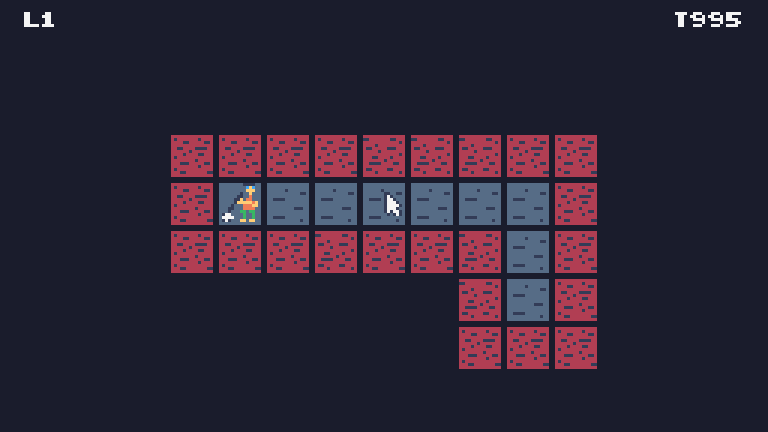

## Overnight Janitor

A tiny maze cleaning game by lzap.

[PLAY IN YOUR BROWSER NOW](https://pillarmaze.zapletalovi.com)

## Gameplay

You are janitor in a maze and the goal is to mop all floors. Wet parts cannot
be walked again and the time is ticking. Will you make it throught the maze?

### Development diary

* Let's make a game, I love these [Fantasy consoles](https://en.wikipedia.org/wiki/Fantasy_video_game_console).
* Let's pick a name: Pillarmaze (a catepillar in a maze).
* Which one is open source and popular? Okay, TIC-80 it is.
* Allright, so the resolution is 240x136 pixels. Cool.
* Let's make a grid 15x8 out of 16x16 sprites with top bar (240x8).
* Sprite flags are as follows:
    * 0 = start position
    * 2 = grey ground
    * 7 = entry not allowed
* Oh I have a better idea for the name: Overnight Janitor!
